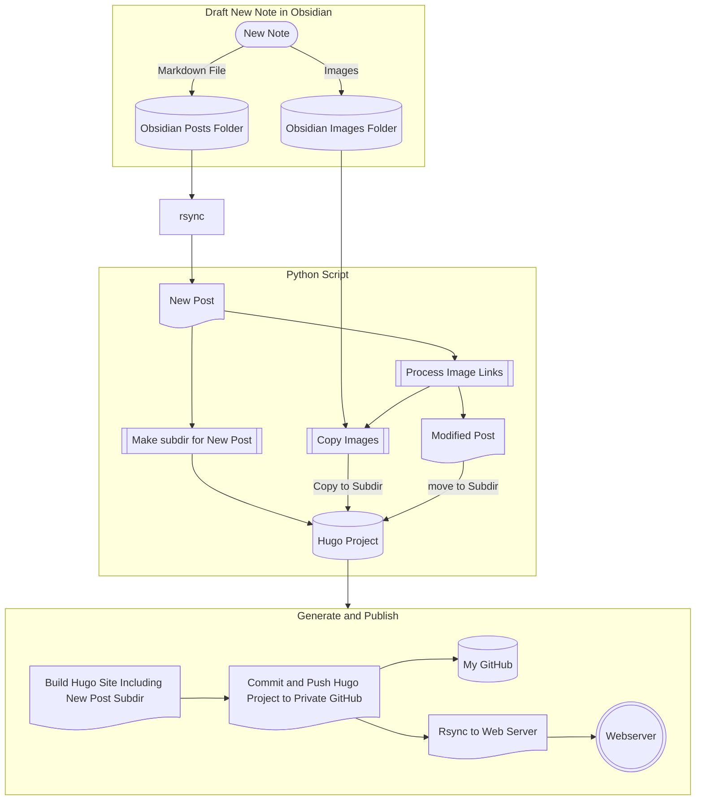

# autoblog
## Goal
These are the scripts that I use to autopublish my [Obsidian](https://obsidian.md) posts to blog posts in my hugo SSG site. Thanks to [Network Chuck](https://www.youtube.com/watch?v=dnE7c0ELEH8) for the inspiration.

## Workflow
* Create an Obsidian note in a specific folder (e.g., "Posts")
* Run a bash script (updateblog.sh), which:
  * Moves any new Post notes from the Posts directory to the content/posts in my HUGO site's directory
  * Calls a python script (imgproc.py) to analyze any .md files at the root of the posts directory. For each md file, it:
      * Makes a new subdir for the post in the content/posts dir
      * Looks for any embedded images and copy those images to the new subdir
      * Converts the obsidian image "urls" to markdown-compatible links
      * Looks for an image that is embedded in the markdown file using the format [image.ext|cover], move that image to the subdir as cover.ext, and remove the reference to the image from the markdown file
      * Looks for an image that is embedded in the markdown file using the format [image.ext|thumbnail], move that image to the subdir as tumbnail.ext, and remove the reference to the image from the markdown file
      * Moves the file from content/posts to the new subdir, renaming it to index.md
  * Calls hugo to build the site locally
  * Uses git to commit and push changes to (in my case, a private) github repo for the site (This repo just stores a copy of the HUGO project. Some may want to deploy the site using git. I have a VPS webserver for that.)
  * Call rysnc to publish the site to webserver (in my case, a VPS running apache in a docker container)
  
## Flow Chart of the Process

## Obsidian
* I use a template (Blog Post Template.md) in Obsidian that automatically creates the front matter for a new blog post note by prompting the user when a new note is made using the template. The Template requires the Templater Plugin. Whenever I make a new note in the Posts Folder, it uses this template.

## Future Plans
* Adding captions to images from Obsidian to the hugo markdown file.
